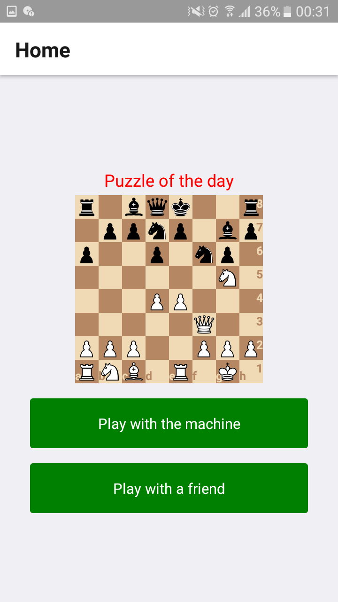
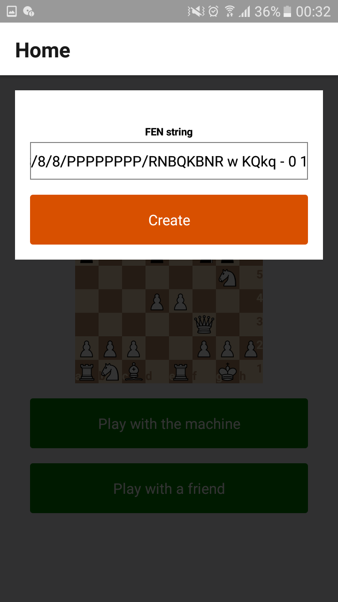
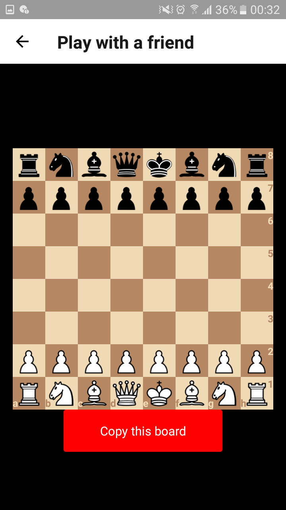

# react-native-expo-chess
  A react native chess game with on-phone 1v1 so you can play with a machine or with a friend as if your phone is a chess board, there are also puzzles to solve and practice your thinking skill.
  
## Reference link
  [react-native](https://github.com/facebook/react-native)  
  [expo](https://expo.io/)  
  [vs code](https://code.visualstudio.com/) 
  [How to chess](https://www.chess.com/learn-how-to-play-chess)
  
## Release
  [build](https://expo.io/builds/3c2cf6de-058a-4da3-91ff-32b4e06fb5b9)
  
## Function and Screenshot
  Note: Game will boot up on the default 'Play with friend' screen 
  
  HOME SCREEN
  
   
  
  Puzzle of the day require Internet connection to work
  You can push the button to play with a friend or play with an AI (AI not very good so that it won't take over the world)
  
  SETUP A GAME
  
    
  
  When playing the puzzle or with a friend or an AI, you can use the red button 'Copy this board' to copy a FEN string into your clipboard and paste it somewhere. 
  So when next time you need to continue the game you can paste this string in to the text box when creating a new game to replicate the position of the piece on the board last time you play. This can be use in a lot of way!
  
  HOT SEAT PLAY WITH FRIEND (OR AI IF YOU DON'T HAVE FRIEND)
  
   
  
  Press on the chess piece, it will show the range of movement of the chess piece with dot on the board, tap where to go on the dot or tap the chess piece again to cancel movement.
 
## "Thing to improve on"
  Add a timer, score board, undo button.
  Improve the save and load mechanic
  Add a 'Highscore' list
  ...
  
## Build instruction
  ```
  yarn install
  expo build:android
  ```
